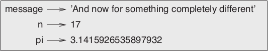

# Leitura do Livro: Pense em Python

DOWNEY, Allen B. Pense em Python. São Paulo: Novatec, ANO.

[Link para o livro no GitHub][1]

[Link para a versão do livro em HTML][2]

<br />

## [1. A Jornada do Programa][3]

<hr />

O objetivo do autor é ensinar a pensar como um cientista da computação. Ele defende que um cientista da computação deve reunir a linguagem formal dos *matemáticos*, a prática de projeção de ideias dos *engenheiros* e a capacidade analítica e de construção de hipótese dos *cientistas*.

Em especial, um cientista da computação deve ter a habilidade de *resolver problemas*. Em sua definição, resolver problemas significa:

<br />

> a capacidade de formular problemas, pensar criativamente em soluções e expressar uma solução de forma clara e precisa.

<br />

### O que é um programa?

> é uma sequência de instruções que especifica uma operação de computação. Esta pode ser algo matemático, uma operação simbólica, algo gráfico, etc

<br />

Os detalhes de um programa podem variar, de acordo com a linguagem, mas algumas instruções básicas aparecem em qualquer programa:

<br />

- **entrada -** receber dados do teclado, de um arquivo, rede ou dispositivo

 - **saída -** exibir dados na tela, salvar em um arquivo, enviar por uma rede, etc

- **matemática -** executar operações matemáticas
 
- **execução condicional -** verificar a existência de uma condição, antes de executar um determinado trecho de código

- **repetição -** executar por diversas vezes uma ação, até que se atinja um resultado esperado

> Programar é o processo de quebrar uma tarefa grande e complexa em pequenas tarefas até que sejam simples o suficiente, para que sejam reduzidas a alguma dessas instruções básicas

### Execução do Python / O primeiro Programa

<br />

Nestes trechos o autor indica a utilização do Python pelo navegador, recomenda o site PythonAnywhere, ser for o caso de instalar o Python na máquina do leitor e, por fim, executa um `print('Hello world')` como primeiro programa.


<br />

### Operadores Aritméticos / Valores e Tipos

Aqui o autor apresenta, em Python, como utilizar os operadores aritméticos mais básicos, valores e tipos de variáveis embutidos da linguagem.

<br />

### Linguagens Formais e Naturais

<br />

Entendemos por linguagens naturais os idiomas falados pelas pessoas, enquanto que linguagens formais são linguagens criadas por pessoas para aplicações específicas.

> **Linguagens de programação são idiomas formais criados para expressar operações de computação.**

Linguagens formais e naturais compartilham elementos: símbolos, estrutura e sintaxe, mas obviamente apresentam diferenças:

- **ambiguidade -** As linguagens naturais apresentam infindas ambiguidades, por seu lado, as linguagens formais, normalmente, se preocupam em eliminar ambiguidades e seus efeitos;
- **redundância -** Linguagens formais tendem a ser menos redundantes, pretendem-se mais concisas que linguagens naturais;
- **literalidade -** Linguagens naturais esbanjam ricas expressões e metáforas, linguagens formais, por outro lado, tem que manter uma séria e rigorosa observância da unicidade de sua semântica;

Pensemos no seguinte: um programa de computador deve atender instruções muito claras, ele deve apresentar eficiência nos seus processos e obedecer precisamente os comandos indicados. Ou seja, sem ambiguidade, com pouquíssima redundância e expressa literalidade.

<br />

### Depuração
> Erros de programação são chamados bugs e o processo de rastreá-los se chama debugging(depuração). (...) Aprender a depurar erros pode ser frustrante, mas é uma habilidade valiosa, útil para muitas atividades além da programação.

<br />

## [2 - Variáveis, Expressões e Instruções][4]

Um dos pontos mais essenciais de um programa é a possibilidade manipular variáveis e seus valores.

### Atribuição

Atribuir é o mesmo que criar uma nova variável e atribuir valor a ela.

Em Python, atribuímos valor a uma variável da seguinte forma:

<br />

```
$ message = "And in the end, the love you take is equal to the love you make"

$ n = 42
```

<br />

Não pode ser mais simples: declaramos o nome da variável e atribuímos a ela o seu valor.

Ao fazermos anotações, podemos utilizar *diagramas de estado* para representar variáveis, colocando o nome da variável e indicando seu valor atual por uma seta:

<br />



<br />

### Nomes de Variáveis

Variáveis devem ter nomes autoexplicativos. Por convenção, variáveis recebem nomes com caracteres minúsculos. O [PEP 8][5] recomenda não apenas caracters minúsculos, mas também o uso de *underscores* para os espaços, da seguinte forma: `minha_variavel`. O nome desse padrão é conhecido como *underscore case*.

Toda linguagem possui restrições quanto a nomeação de variáveis. Normalmente, começar o nome por um numeral resulta em erro, caracteres especiais como @, por exemplo, também são proibidos. Além disso, há uma lista de palavras-chaves reservadas para funções internas do Python. Por óbvio, essas palavras não poderão ser usadas e o *runtime* da linguagem retornará erro, caso a tentativa seja feita.

<br />

```
and         del         from        None        True
as          elif        global      nonlocal    try
assert      else        if          not         while
break       except      import      or          with
class       False       in          pass        yield
continue    finally     is          raise
def         for         lambda      return
```
##### A lista de palavras-chaves do Pyton

<br />

## Expressões e Instruções

<br />

Uma *expressão* é uma combinação de variáveis, valores e operadores. Somente um dos elementos é condição suficiente para que uma expressão exista. Ou seja, todas as situçãoes abaixo são consideradas expressões, desde que a variável `a` tenha valor atribuído:

<br />

```
$ 42
$ a
$ a + 42
```

<br />

Uma *instrução* é uma unidade de código que tem um efeito. São exemplos de instruções: atribuir valor a uma variável, exibir um valor na tela, entre outros. Quando uma intrução é digitada, o interpretador a executará, realizando o propósito indicado por ela.

> *Em geral, instruções não tem valores*

```
$ n = 15
$ print("espere por mim, morena")
```

<br />

### Depuração

<br />

Os três tipos de erros em um programa são:

- **Erro de Sintaxe -** este se refere à estrutura da linguagem ou do código e suas regras. Havendo um erro de sintaxe, o Python exibirá uma mensagem de erro, impedindo a execução do programa. Por exemplo, um parêntesis esquecido ou um nome de comando digitado errado;
- **Erro de Tempo de Execução (Runtime Error) -** é um erro que não aparece, até que o programa seja executado. São também chamados *exceções*;
- **Erro Semântico -** é um tipo de erro silencioso, pois não se refere à forma de algo, mas a seu conteúdo. É o caso por exemplo de uma função que não executa bem o que se espera dela, ou uma atribuição de valor errado à uma variável. Esse erro só é possível de ser detectado por um trabalho de engenharia reversa, até que se encontre no código o que o está provocando.

[1]: https://github.com/PenseAllen/PensePython2e
[2]: https://penseallen.github.io/PensePython2e/
[3]: https://penseallen.github.io/PensePython2e/01-jornada.html
[4]: https://penseallen.github.io/PensePython2e/02-vars-expr-instr.html
[5]: https://peps.python.org/pep-0008/#function-and-variable-names